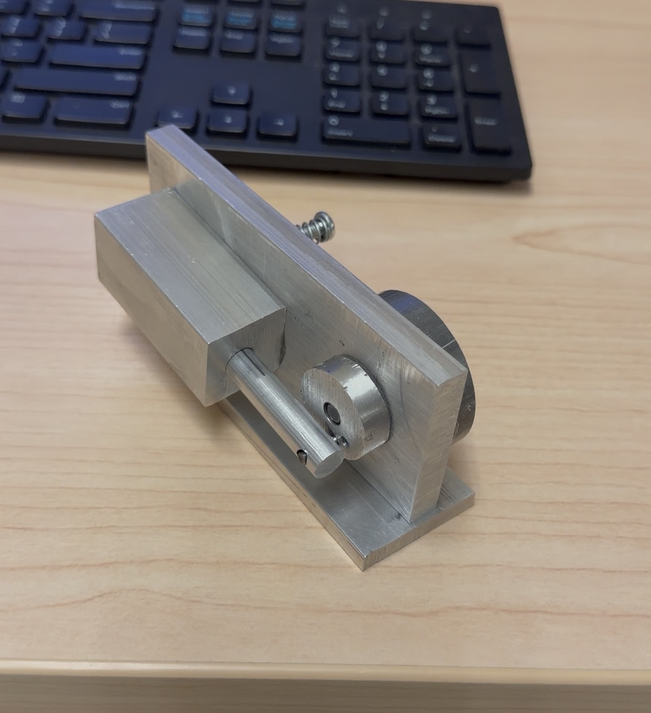

# Oscillating Air Engine

A single-cylinder oscillating pneumatic engine designed, machined, and assembled from scratch
as part of a mechanical engineering course project at Syracuse University.

## Overview

Designed and manufactured a fully functional pneumatic air engine. The project covered the full engineering workflow from SolidWorks
modeling and GD&T drawings to machining and functional testing.

## Design & CAD

- Modeled all components and assemblies in SolidWorks
- Created manufacturing drawings with GD&T annotations including datums, tolerances,
  and flatness controls
- Performed tolerance stack-up analysis on critical mating interfaces to ensure proper
  fit and function

## Manufacturing

- Machined components from aluminum using a manual lathe and mill
- Followed engineering drawings for all dimensions and surface finish requirements
- Assembled and tested the engine, verifying operation against design intent

## Files

- `/drawings/` — Manufacturing drawings (PDF)
- `/cad/` — SolidWorks part and assembly files
- `/analysis/` — Tolerance stack-up spreadsheet

## Skills Demonstrated

SolidWorks · GD&T · Tolerance analysis · Manual machining · Precision assembly · Technical documentation
